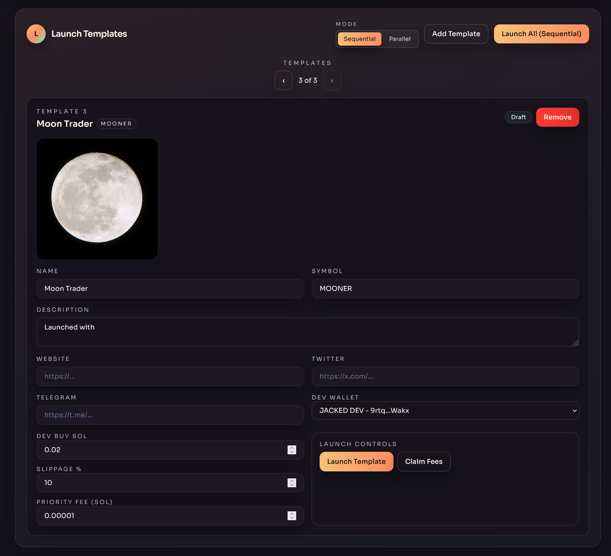
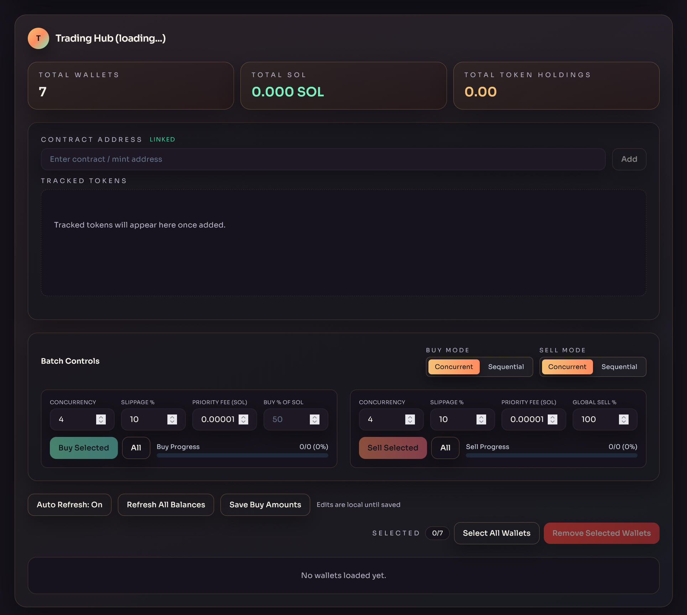
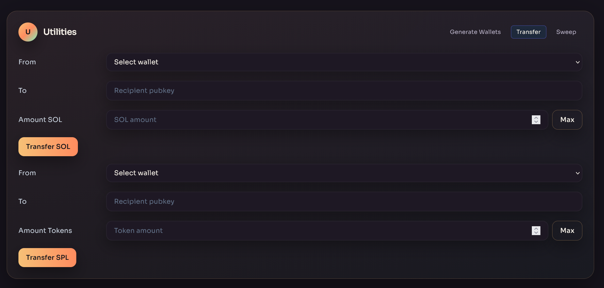

# PumpLaunch V2

PumpLaunch V2 is a production-ready control center for orchestrating Pump.fun launches and trading flows. It pairs an Express API with a React dashboard to create tokens, manage wallet fleets, and coordinate buys/sells from one screen. The app talks to the [PumpPortal local API](https://pumpportal.fun/) for creation/trading.

### Console walkthrough

<div align="center">
  <video src="doc-assets/console_preview.mp4" controls title="PumpLaunch V2 console preview" style="max-width: 100%;"></video>
</div>

### Screenshots

| Token Templates | Trading Hub | Utilities |
| --- | --- | --- |
|  |  |  |

## Features

- Launch Templates: batch or per-template launches with artwork upload, per-template dev wallet selection, and live status (tx + mint + Pump.fun link).
- Trading Hub: batch buy/sell with sequential or concurrent mode, progress bars, and per-wallet overrides for buy % / sell %.
- Wallet fleet: generate/import buyers, assign dev wallet, per-wallet mint selection, per-wallet refresh, and per-wallet buy/buy%/sell actions (dev wallet included).
- Balance insight: SOL + token totals, per-wallet balances, manual refresh, and auto-refresh toggle.
- Transfers & sweeps: SOL/SPL transfer helpers, SOL/SPL sweep into a target, plus fee collection for the dev wallet.
- State & tracking: tracked token list, contract address picker, recent mints, activity log via SSE, and persistent JSON state.
- Safety UX: destructive actions now use solid red buttons; secrets export is explicit; copy helpers on pubkeys/mints/tx.
- Toasted feedback: transaction toasts update from submitted to confirmed/failed via live status polling.

## Prerequisites

- Node.js 18+
- Funded Solana wallets for dev and buyers
- Optional `.env` to override defaults in `src/config.js` (see `.env.example`)

## Installation

Windows quick install: run `install.bat`.

```bash
# from repo root
npm install           # install server + client deps (via workspaces)
npm run client:build  # build the React UI
```

## Running

```bash
# production bundle (serves UI + API on :3000)
npm start

# or run pieces during dev
npm run server       # API + SSE only on :3000
npm run client:dev   # Vite dev server on :5173
npm run client:preview  # preview built client
```

Open `http://localhost:3000` (or Vite dev URL) to use the dashboard.

## Usage Guide

1. Link a contract (mint): paste a mint in the contract box and click Add. It's added to Tracked Tokens and becomes the active mint for all wallets.
2. Manage wallets: generate/import buyers, assign a dev wallet, export keys, or remove. Each card lets you pick a mint, refresh its balance, and run buy/buy%/sell.
3. Launch tokens: build a template (name, symbol, description, artwork, dev wallet, fees) and launch sequentially or in parallel. Mint/tx and Pump.fun link are shown on success.
4. Trade in bulk: select wallets, set concurrency/slippage/fees, and run Buy Selected or Sell Selected. Per-wallet overrides are respected.
5. Move funds: use Utilities to transfer SOL/SPL, sweep wallets to a sink, or collect creator fees.
6. Monitor: watch logs in the Activity Log; use per-wallet refresh or Refresh All to update balances; transaction toasts track confirmation.

## Configuration & Data

| Path | Purpose |
| --- | --- |
| `src/config.js` | RPC URL, fee defaults, file locations. |
| `wallets/dev.json` | Dev wallet (base58 secret). |
| `wallets/buyers.json` | Buyer wallets and per-wallet overrides. |
| `data/state.json` | Persisted UI state (mint, recent mints, last balances). |

Key env vars: `HELIUS_RPC_URL` (preferred) or `RPC_PROVIDER`, `DEFAULT_BUY_SOL`, `DEFAULT_SLIPPAGE_PERCENT`, `DEFAULT_PRIORITY_FEE_SOL`, `DEFAULT_CONCURRENCY`, `MAX_CONCURRENCY`, and file path overrides. See `.env.example`.

## Safety Notes

- Wallet JSON files are git-ignored; back them up securely.
- Red buttons indicate destructive actions (removes, sweeps, etc.).
- Confirm mints and percentages before trading; every action sends on-chain transactions.

## Troubleshooting

- UI missing? Run `npm run client:build` then `npm start`.
- Balances stale? Use `Refresh All Balances` or per-wallet refresh; ensure a mint is active.
- RPC issues? Point `HELIUS_RPC_URL` to a healthy endpoint.

